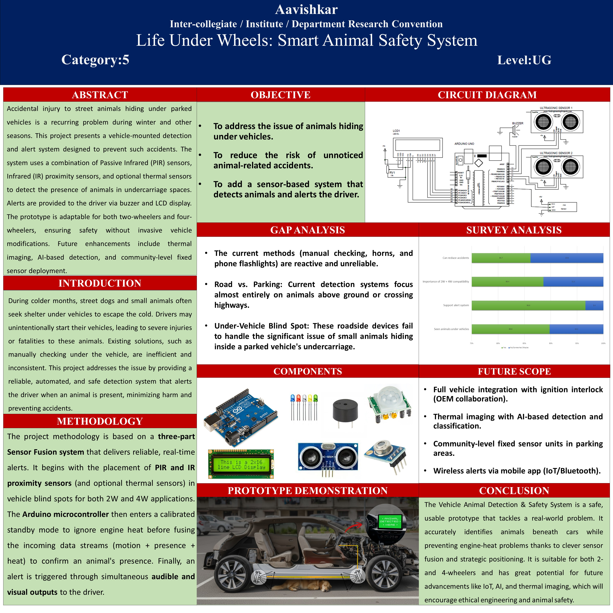

# 🐾 Life Under Wheels – Animal Safety System

> A research-driven smart safety system designed to detect animals hiding beneath parked vehicles and alert drivers before ignition.

---

## 📌 Problem Overview

In urban and semi-urban environments, small animals such as cats and dogs often seek warmth under parked vehicles. When drivers start their vehicles without noticing them, it can result in severe injury or death.

Existing vehicle safety systems focus on:
- Collision avoidance
- Highway animal crossings
- Driver-assist features during motion

However, **the under-vehicle blind spot in stationary vehicles remains largely unaddressed.**

Life Under Wheels was designed to bridge this gap.

---

## 🎯 Objective

- Detect animals beneath parked vehicles before engine ignition  
- Reduce preventable animal fatalities  
- Provide real-time audio-visual alerts  
- Design a low-cost, scalable, and ethical engineering solution  

---

## 🧠 System Architecture

The system follows a **multi-layer sensor fusion approach**:

### Core Components

- Arduino Uno (Processing Unit)
- PIR Sensor (Motion & Heat Detection)
- Ultrasonic Sensor (Distance Confirmation)
- Thermal Sensor (Body Temperature Validation)
- Buzzer (Audible Alert)
- LED Indicators (Visual Alert)
- LCD Display (System Status Output)

---

## ⚙️ Working Methodology

1. System initializes on power activation  
2. PIR detects motion beneath vehicle  
3. Ultrasonic confirms object presence within range  
4. Thermal sensor validates body heat signature  
5. Sensor fusion logic verifies detection  
6. Buzzer + LED + LCD alert driver  

This layered verification significantly reduces false positives caused by debris or engine heat.

---

## 📊 Cost Analysis (Estimated)

| Component Category | Cost (₹ INR) |
|--------------------|-------------|
| Microcontroller & Sensors | 1,210 |
| Alert & Display Modules | 300 |
| Power & Regulation | 70 |
| Housing & Mounting | 950 |
| **Total Estimated Cost** | **2,530** |

The affordability enables scalability and retrofitting potential.

---

## 🖼 Project Visuals

---

## 📄 Documentation

- 📘 Full Research Paper:  
  `assets/life-under-wheel-research-paper.pdf`

- 📊 Presentation Slides:  
  `assets/life-under-wheel-presentation.pptx`

---

## 🚀 Future Scope

- Ignition interlock integration with OEM manufacturers  
- AI-based thermal imaging and animal classification  
- IoT-enabled mobile notifications  
- Community-level parking safety monitoring systems  

---

## 🏆 Research Recognition

Presented at **Avishkar Inter-Collegiate Research Convention (UG Level)**.  

This project reflects structured problem analysis, system design thinking, ethical engineering principles, and scalable solution modeling.

---

## 👩‍💻 Author

Hiral Dhakoliya  
B.Sc. Computer Science  
University of Mumbai  

Focused on building research-backed, real-world technology systems combining engineering logic with product thinking.

